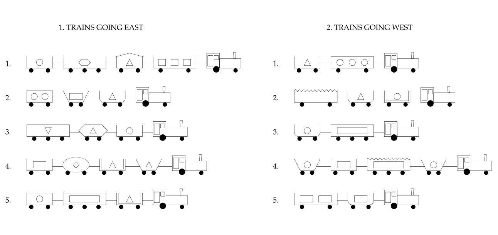
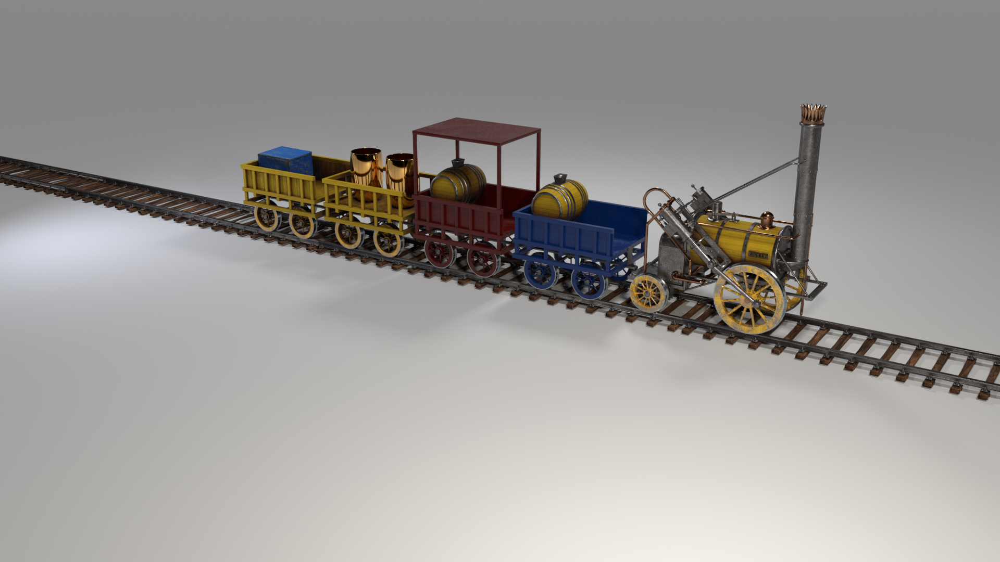
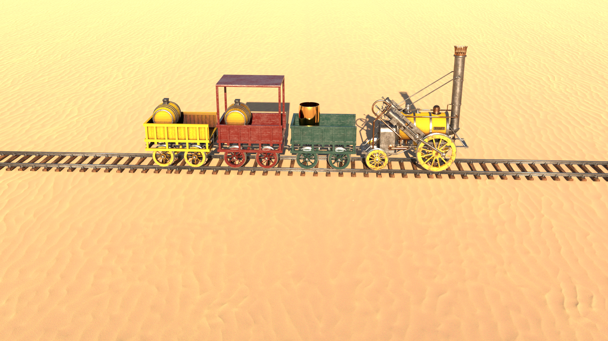
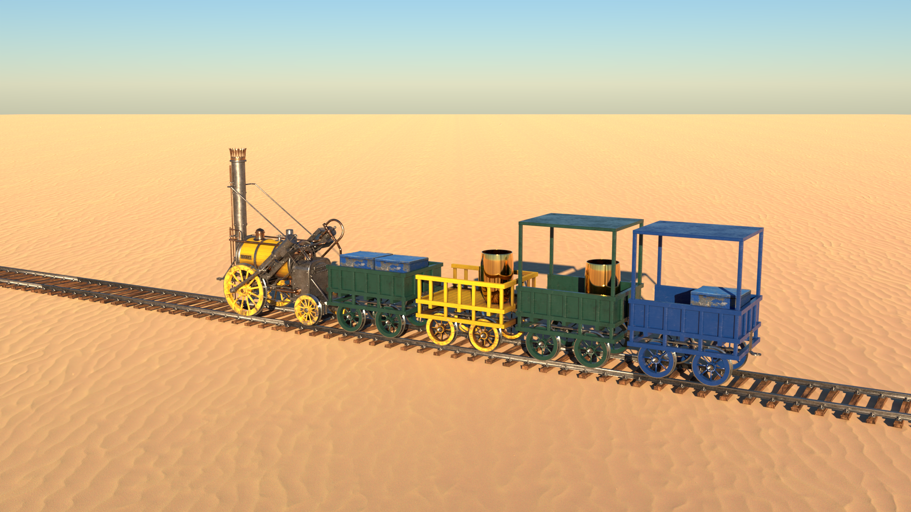
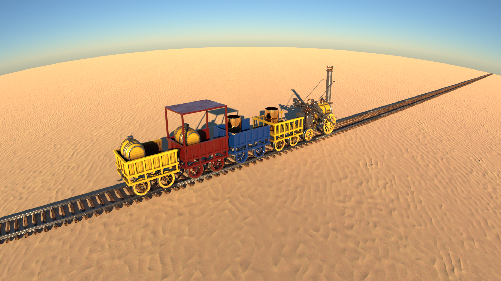
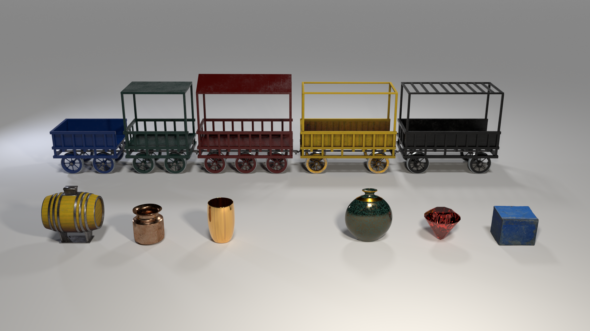
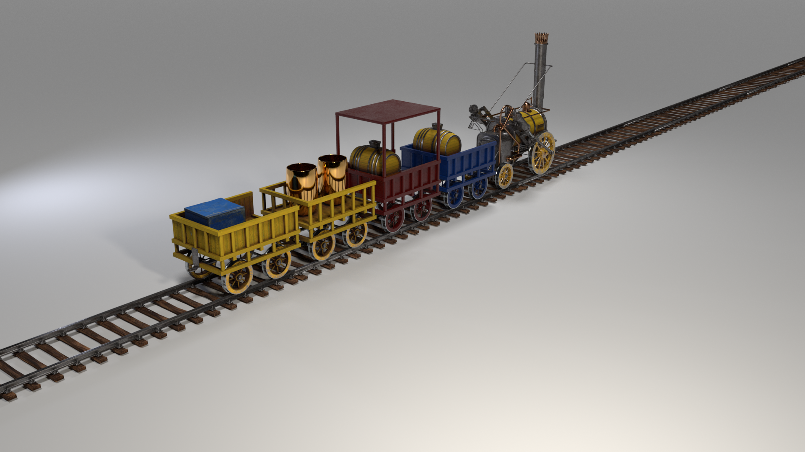
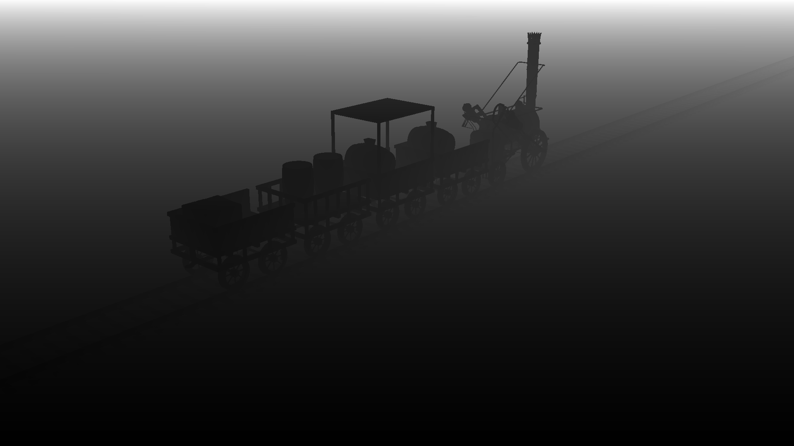
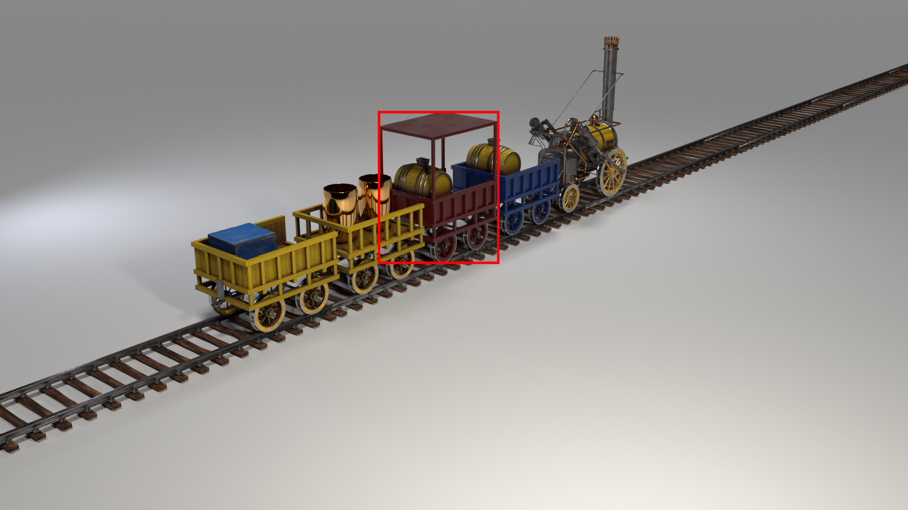
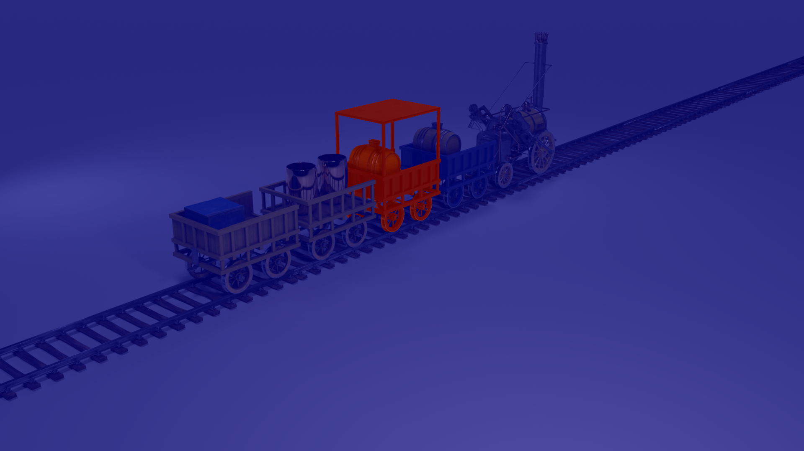

# The Three Dimensional Michalski Train Generator

Repository for the three-dimensional Michalski train generator introduced in
Bringing the third dimension into the Michalski train problem.

The Michalski train problem [[1]](#1) proposed by Ryszard S. Michalski in 1980 represents
one of the most prominent challenges in the domain of relational learning. The problem
constitutes a set of trains, which are composed of a wide variety of properties and labelled
into the two categories eastbound and westbound trains. Now it is up to the viewer
to ascertain a classification hypothesis governing what kinds of trains head eastbound
and what kinds head westbound. The conjectured hypothesis should accomplish both
assigning correct labels while retaining the highest possible degree of simplicity. It is
certainly easy to find a classification hypothesis satisfying a given set of Michalski trains,
e.g. learning the trains by heart. However, due to the great number of train properties, it
is a major challenge to find the most simple and general decision hypothesis.

This study takes the Michalski train problem even a step further by introducing a three-dimensional
Michalski train generator. An image generator that allows to establish versatile datasets for deep image understanding,
relational and analogical (grounded) visual reasoning.
This research aims to contribute an ILP dataset which allows to incorporate the complex rule-based logic of the
Michalski
train problem and establish a modern three-dimensional dataset creating a problem of inductive inference.
The resulting datasets allow for diagnostic insights into the method’s decision-making process as well as its
capabilities of rule-based learning.

You can use this code to generate Michalski train descriptions, render their corresponding images and
create a three-dimensional Michalski train dataset.

<div align="center">
  
  
</div>

## Instructions for setting up the docker container

A docker container can be used to set up the required environment.
Additionally, CUDA 11.3+, docker and nvidia-container-toolkit must be installed to allow the
usage of the docker container and enable image rendering.

For easier handling we recommend:
create a screen: screen -S train_generator

Then:

1. cd to TrainGenerator folder
2. docker build -t blender_train_generator -f Dockerfile .
3. docker run --gpus device=0 -v $(pwd):/home/workdir blender_train_generator python3 main.py

## Generating images

This is a very brief instruction on how the three-dimensional Michalski train dataset is generated.
At first, we generate train descriptions for the whole dataset resorting to a slightly adapted version of Muggleton's
train generator.
We have extended the code to assign labels to the generated train descriptions according to a specified decision rule.
A default decision rule is specified in TrainGenerator/classification_rule.pl which can be adjusted as desired.
Subsequently, we render images for the individual train descriptions, generate their ground-truth information creating a
dataset.
The train generator provides a wide range of settings allowing to adapt to the given requirements.
The default output location is TrainGenerator/output/image_generator/.

### Script parameters

The following settings are available, the input typ and default settings are noted in parentheses:

- dataset_size (int, 10,000) -> Size of the dataset we want to create
- index_start (int, 0) -> start rendering images at index (index_start)
- index_end (int, None) -> stop rendering images at index (does not render index_end).
  If None the train generator stops rendering at dataset_size.

- train_type (str, MichalskiTrains) -> The train type we want to generate. Either 'MichalskiTrains' or 'RandomTrains'
- background_scene (str, base_scene) -> Scene in which the trains are set: 'base_scene', 'desert_scene', 'sky_scene'
  or 'fisheye_scene'

- with_occlusion (bool, False) -> Whether to include train angles which might lead to occlusion of the individual train
  attributes
- save_blender (bool, False) -> Whether the blender scene is saved.
  Only recommended for small image counts as the blend files are of rather big size.
- high_res (bool, False) -> whether to render the images in high resolution (1920x1080) or standard resolution (480x270)
- gen_depth (bool, False) -> Whether to generate the depth information of the individual scenes
- replace_raw (bool, False) -> If the train descriptions for the dataset are already generated shall they be replaced?
- replace_existing_img (bool, False) -> Check if the image is already rendered for the individual indices.
  If there is already an image generated for a specific index shall do you want to replace it?

The following shows example images of the four background scenes 'base_scene', 'desert_scene', 'sky_scene' and '
fisheye_scene':

<div align="center">
  
  
  
  
</div>

The start and stop indices parameters allow for parallelization when one dataset is established.
Therefore, you need to start multiple docker containers each generation images at different indices at the dataset.
Keep in mind to use different docker containers as the blender engine has problems to render parallel.

### Decision rule

If Michalski trains are generated, the train generator allows the creation of a labeled train dataset.
Therefore, the labels are derived from the prolog classification rule noted in TrainGenerator/classification_rule.pl.
The trains generated are subject to a balanced distribution of the individual classes so that we have an equal
number of trains heading eastbound and westbound within our dataset.
Be aware that defining a very specific decision rules can have a strong influence on the distribution of train
attributes, which in turn can lead to similar images being generated.

By default, we resort to the classification rule known as 'Theory X' which is defined as follows:

    There is either a short, closed car, or a car with a circular load somewhere behind a car with a triangular load.

In Prolog the rule can be expressed as follows:

    eastbound([Car│Cars]):-
    (short(Car), closed(Car));
    (has_load0(Car,triangle), has_load1(Cars,circle));
    eastbound(Cars).

In FOL it can be noted as follows:

eastbound(Train) &vDash;
&exist; Car_1, Car_2 has-car(Train, Car_1) &and; has-car(Train, Car_2) &and;
((short(Car_1) &and; closed(Car_1)) &or;
(has-load(Car_1,golden-vase) &and; has-load(Car_2,barrel) &and;
somewhere-behind(Train, Car_2, Car_1)))

The classification rule noted in classification_rule.pl can be adjusted according to the requirements.
This allows us to increase or decrease the complexity of the rule-based problem incorporated into the generated dataset.
Herby the classification rule must be expressed in the Prolog description language using the provided descriptors
predicates.
However, by resorting the defined predicates, it is also possible to define and apply new predicates.

At default the following predefined descriptors are available.
While T refers to the whole train as in input, C, C1, C2 refer to a single car.

- Car descriptors
    - has_car(T,C)
    - infront(T,C1,C2)

- Car shape descriptors
    - ellipse(C)
    - hexagon(C)
    - rectangle(C)
    - u_shaped(C)
    - bucket(C)

- Car length descriptors
    - long(C)
    - short(C)

- Car wall descriptor
    - double(C)

- Car roof descriptors (R: roof, N: car number)
    - has_roof(C,r(R,N))
    - open(C)
    - closed(C)

- Car wheel count descriptor (W: wheel count, NC: car number)
    - has_wheel(C,w(NC,W))

- Car payload descriptor
    - has_load0(C,Shape)
    - has_load1(T,Shape)

The defined descriptors can be allocated the following descriptor values:

    car_shape(1,ellipse). car_shape(2,hexagon). car_shape(3,rectangle). car_shape(4,u_shaped). car_shape(5,bucket).
    car_length(1,short). car_length(2,long).
    car_open(1,open). car_open(2,closed).
    car_double(1,not_double). car_double(2,double).
    roof_shape(1,none). roof_shape(2,flat). roof_shape(3,jagged). roof_shape(4,peaked). roof_shape(5,arc).
    load_shape(1,circle). load_shape(2,diamond). load_shape(3,hexagon). load_shape(4,rectangle). load_shape(5,triangle). load_shape(6,utriangle).

### Transformation into a three-dimensional train representation

Some of the above listed descriptors which were used in the original Michalski train representation heavily rely on
their
two-dimensional delineation and do not meet the requirements of a vivid three-dimensional visualization.
Accordingly, we have transformed the original train representation relying on more appropriate descriptors and
descriptor values. For detailed information on the transformation see ###paper.
An overview of the three-dimensional Michalski train descriptors and their assignable values can be found below:

| Car position | Car colour | Car length | Wall type | Roof shape  | Number of wheels | Payload 1 & Payload 2 & Payload 3 | Orientation |
|:------------:|:----------:|:----------:|:---------:|:-----------:|:----------------:|:---------------------------------:|:-----------:|
|      1       |   yellow   |   short    |   full    |    none     |        2         |             blue box              | angle alpha |
|      2       |   green    |    long    |  braced   | foundation  |        3         |            golden vase            |
|      3       |    grey    |     	      |    		     | solid roof  |                  |              barrel               |
|      4       |    red     |     		     |    			    | braced roof |                  |              diamond              |
|              |    blue    |     		     |    		     | peaked roof |        		        |             metal pot             |
|     			      |     		     |     		     |    			    |     		      |                  |             oval vase             |
|      		      |     		     |     		     |    			    |     		      |                  |               none                |

The following image illustrates the above described descriptors.

<div align="center">
  
</div>

### Transformation into a three-dimensional simple representation

The Train generator also allows for a simpler visualization relying on less complex objects.
This representation is based on the following descriptors:


| Object position | Color  | Platform length | Side object frustum | Platform shape  | Side object torus | Object 1 & Object 2 & Object 3 | Orientation |
|:---------------:|:------:|:---------------:|:-------------------:|:---------------:|:-----------------:|:------------------------------:|:-----------:|
|        1        | yellow |      short      |   larger side up    |      cube       |       above       |             sphere             | angle alpha |
|        2        | green  |      long       |  larger side down   |    cylinder     |       below       |            pyramid             |
|        3        |  grey  |        	        |         		          |   hemisphere    |                   |              cube              |
|        4        |  red   |       		        |         			         |     frustum     |                   |            cylinder            |
|                 |  blue  |       		        |         		          | hexagonal prism |        		         |              cone              |
|       			       |   		   |       		        |         			         |       		        |                   |             torus              |
|       		        |   		   |       		        |         			         |       		        |                   |              none              |


The following image illustrates the above described descriptors.

### Ground truth scene information

For each image the ground truth information of the scene is saved as a Json file inside the 'scenes' folder.
For each car we save the binary mask in form of an encoded RLE file.
The binary masks of the car wall, car wheels and the individual payloads are also saved inside the Json.
For each scene the Json file contains the following information:
output

```
m_train.json
│
└base_scene
└train_type
└image_index
└image_filename
└blender_filename
└depth_map_filename
└m_train
└angle
└───car_masks: {
    "car_1": {
      "mask": {rle},
      "world_cord": [ x, y, z ],
      "roof": {
        "label": roof type },
      "wall": {
        "label": wall type,
        "mask": {rle file},
        "world_cord": [x,y,z]
      },
      "wheels": {
        "label": number of wheels,
        "mask": {rle},
        "world_cord": [x,y,z]
      },
      "color": {
        "label": color
      },
      "length": {
        "label": legth
      },
      "payload_0": {
        "label": "oval_vase",
        "mask": {rle},
        "world_cord": [x,y,z]
      },
      "payload_1": {
        ...
      },
     ...
    },
    "car_2": {
      ...
    },
    ...
   }
```

The following shows an overview of some of the ground truth information described above:

<div align="center">
  
  
  
  
</div>

### Dataset structure

Once the dataset is generated we can find it in the folder TrainGenerator/output/. The dataset is structured as follows:

```
output
│
└───MichalskiTrains
│   │
│   └───base_scene
│   │   │
│   │   └───blendfiles
│   │   │     │0_m_train.blend
│   │   │     │...
│   │   │
│   │   └───depths
│   │   │     │0_m_train.png
│   │   │     │...
│   │   │
│   │   └───images
│   │   │     │0_m_train.png
│   │   │     │...
│   │   │
│   │   └───scenes
│   │         │0_m_train.json
│   │         │...
│   │
│   └───desert_scene
│   │   │...
│   │...
│
└───RandomTrains
│   │...
│...
```

The images rendered can be found in the images' folder.
The corresponding ground truth information is located in the 'scenes' folder.
The depth information of the individual images is located in the 'depths' folder (if depth_gen is opted).
The blender scene which is used to render the individual images is located in the 'blendfiles' folder (if save_blend is
opted).

## References

<a id="1">[1]</a>
Ryszard S. Michalski. “Pattern Recognition as Rule-Guided Inductive Inference”. In:
IEEE Transactions on Pattern Analysis and Machine Intelligence PAMI-2.4 (1980),
pp. 349–361. doi: 10.1109/TPAMI.1980.4767034.

## Citation

If you find this dataset useful in your research, please consider citing:

[//]: # (> @unpublished{HelffTrains,)

[//]: # (> title={Bringing the third dimension into the Michalski train problem},)

[//]: # (> author={Helff, Lukas and Stammer, Wolfgang and Kersting, Kristian},)

[//]: # (> note= {unpublished},)

[//]: # (> year={2022})

[//]: # (> })

[//]: # (    journal={arXiv preprint arXiv:2011.12854},)