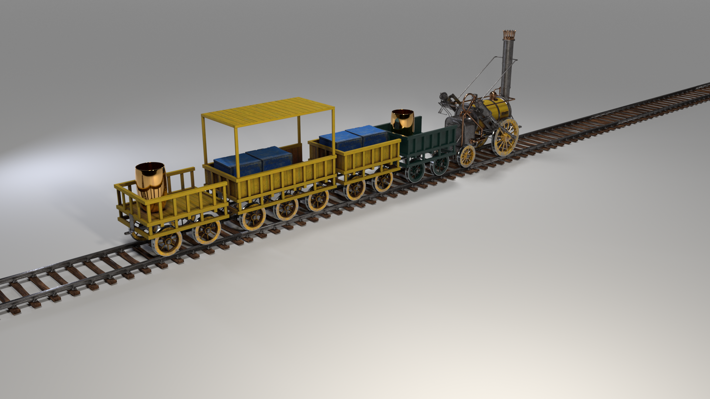
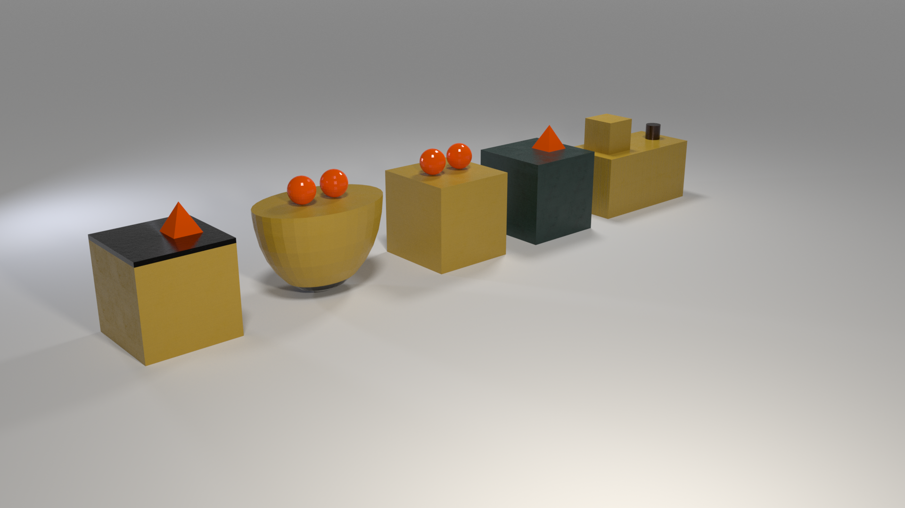
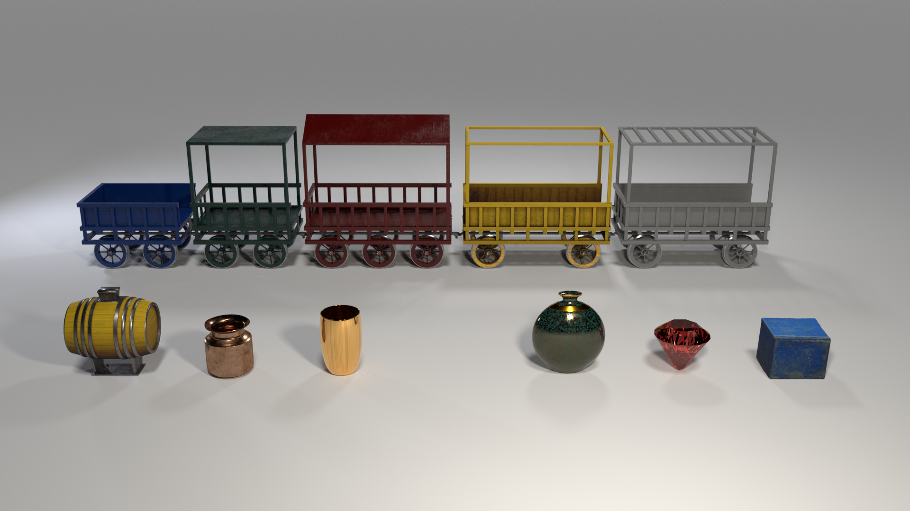
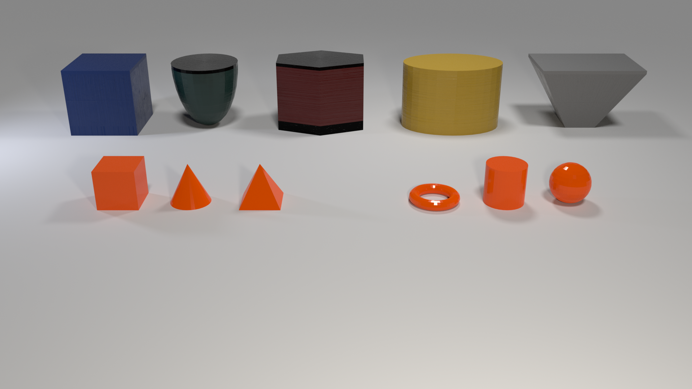

# The Three Dimensional Michalski Train Generator

Repository for the three-dimensional Michalski train generator introduced in `...` .

The Michalski train problem [[1]](#1) proposed by Ryszard S. Michalski in 1980 represents
one of the most prominent challenges in the domain of relational learning. The problem
constitutes a set of trains, which are composed of a wide variety of properties and labeled
into the two categories `Eastbound` and `Westbound` trains. It is up to the viewer
to generate a classification hypothesis governing what trains are eastbound
and what are westbound. The conjectured hypothesis should accomplish both
assigning the correct labels while retaining a degree of generality. It is
certainly easy to find a classification hypothesis satisfying a given set of Michalski trains,
e.g. learning the trains by heart. However, due to the great number of train properties, it
is a major challenge to find the most general decision hypothesis.

This study takes the Michalski train problem one step further by introducing a three-dimensional
Michalski train generator. An image generator that allows to establish versatile datasets for deep image understanding,
relational and analogical (grounded) visual reasoning.
This research aims to contribute an ILP dataset which allows to incorporate the complex rule-based logic of the
Michalski train problem and establish a modern three-dimensional dataset creating a problem of inductive inference.
The resulting datasets allow for diagnostic insights into an AI model’s decision-making process as well as its
capabilities of rule-based learning.

<div align="center">
  
</div>
<div align="center">
  
  
</div>

In the top image you can see the original Michalski trains, in the bottom images you can see example images from our
novel 3D Michalski train generator.

You can use the code of this repository to generate Michalski train descriptions, render their corresponding images and
create a three-dimensional Michalski train dataset. Below we provide detailed descriptions and explanations of the
necessary steps to create the datasets.

## Instructions for setting up the docker container

A docker container can be used to set up the required environment.
Additionally, CUDA 11.3+, docker and nvidia-container-toolkit must be installed to allow the
usage of the docker container and enable image rendering.

For easier handling we recommend to create a screen: `screen -S train_generator`

Then:

```bash
cd TrainGenerator
docker build -t blender_train_generator .
docker run --gpus device=0 -v $(pwd):/home/workdir blender_train_generator python3 main.py
```

## Overview

This is a very brief instruction on how the three-dimensional Michalski train dataset is generated.
At first, we generate train descriptions for the whole dataset resorting to a slightly adapted version of Muggleton's
train generator [[2]](#2).
We have extended the code to assign labels to the generated train descriptions according to a specified decision rule.
For this purpose you can choose one of the decision rules specified in the `example_rules` folder.
The `custom_rule.pl` file can be used to define your own personal decision rule. For a more in depth description on the
individual rules see section below.
Subsequently, we render images for the individual train descriptions, generate their ground-truth information creating a
dataset.
The train generator provides a wide range of settings allowing to adapt to the given requirements.
The default output location is `TrainGenerator/output/image_generator/`.

## Script parameters

The following settings are available, the corresponding input types and default settings are noted in parentheses:

General settings:

- `dataset_size` (int, 10,000) -> Size of the dataset we want to create.
- `index_start` (int, 0) -> Start rendering images at index (index_start).
- `index_end` (int, None) -> Stop rendering images at index (does not include rendering image index_end).
  If None the train generator stops rendering at dataset_size.
- `output_path` (str, 'output/image_generator') -> path to the output directory in which the generated datasets are
  saved.

Classification & Visualization settings:

- `classification_rule` (str, 'theoryx') -> The classification rule used for generating the labels of the dataset.
  The following rules are available: 'theoryx', 'easy', 'color', 'numerical', 'multi', 'complex', 'custom'.
  For more detailed information about the rules refer to the rule section.
  Select custom rule to use your own personal rule. Therefore, define your own rule in \'example_rules/custom_rule.pl\'.
- `description` (str, 'MichalskiTrains') -> The train descriptions we want to generate. Either 'MichalskiTrains' or '
  RandomTrains'.
  The 'RandomTrains' descriptions are generated randomly.
  The 'MichalskiTrains' descriptions are generated according to distributional assumptions defined by
  Muggleton [[2]](#2).
- `visualization` (str, 'Trains') -> The way we want to visualize the descriptions. Either as 'Trains' or '
  SimpleObjects'. For comparison see images above.
- `background_scene` (str, 'base_scene') -> Scene in which the trains are set: 'base_scene', 'desert_scene', 'sky_scene'
  or 'fisheye_scene'.
- `with_occlusion` (bool, False) -> Whether to include train angles which might lead to occlusion individual parts of
  the train.

Additional settings:

- `save_blender` (bool, False) -> Whether the blender scene is saved.
  Only recommended for small image counts as the blend files can be quite large.
- `high_res` (bool, False) -> Whether to render the images in high resolution (1920x1080) or standard resolution (
  480x270)
- `gen_depth` (bool, False) -> Whether to save depth information of the individual scenes.
- `replace_descriptions` (bool, False) -> If the train descriptions for the dataset are already generated shall they be
  replaced?
- `allow_parallel` (bool, True) -> Enables parallel generation of one dataset. Recommended to clear tmp folder before.
  Images generated in tmp folder from previously uncompleted runs (of the same settings) are not deleted.

Enables parallel generation of one dataset. Recommended to clear tmp folder before. '
'Images generated in tmp folder from previously uncompleted runs (of the same settings) '
'are not deleted.

The following shows example images of the four background scenes 'base_scene', 'desert_scene', 'sky_scene' and '
fisheye_scene':

<div align="center">
  
  
  
  
</div>

The start and stop indices parameters allow for parallelization if large datasets need to be generated.
Therefore, you need to start multiple docker containers each generation images at different indices at the dataset.
Keep in mind to use different docker containers as the blender engine has problems to render parallel.

## Decision rule

The labels of the generated train are derived from the selected classification rule. The generated trains are subject to
a balanced class distribution.
Accordingly, we have an equal number of trains heading eastbound and westbound within our dataset.
The different rules allow us to increase or decrease the complexity of the rule-based problem which is incorporated
into our dataset.

In the `example_rules` folder we provide a selection of predefined rules with varying degrees of complexity.
The rules are expressed in the Prolog description language. In the case you want to define your own personal rules
select and adjust the `example_rules/custom_rule.pl` according to your requirements. 
For this you can either rely on the predefined set of predicates described in the section below or create your own
descriptors.
Be aware that defining a very specific decision rules can have a strong influence on the distribution of train
attributes, which in turn can lead to similar images being generated as it might become difficult to create random
variations based on a very specific rule.

By default, we resort to the classification rule known as **'Theory X'** which is defined as follows:

    There is either a short, closed car, or a car with a circular load somewhere behind a car with a triangular load.

In Prolog the rule can be expressed as follows:

    eastbound([Car│Cars]):-
    (short(Car), closed(Car));
    (has_load0(Car,triangle), has_load1(Cars,circle));
    eastbound(Cars).

[//]: # (In FOL it can be noted as follows:)

[//]: # ()

[//]: # (  eastbound&#40;Train&#41; &vDash;)

[//]: # (  &exist; Car_1, Car_2 has-car&#40;Train, Car_1&#41; &and; has-car&#40;Train, Car_2&#41; &and;)

[//]: # (  &#40;&#40;short&#40;Car_1&#41; &and; closed&#40;Car_1&#41;&#41; &or;)

[//]: # (  &#40;has-load&#40;Car_1,golden-vase&#41; &and; has-load&#40;Car_2,barrel&#41; &and;)

[//]: # (  somewhere-behind&#40;Train, Car_2, Car_1&#41;&#41;&#41;)

The other classification are denoted as follows:

- **easy rule:** The train has a short and a long car with the same colour.
- **colour rule:** The train has three differently coloured cars.
- **easy rule:** The train has a short and a long car with the same colour.
- **multi case rule:** The train has either a car with braced walls and 2 loads, or a blue car with 3 loads or a blue
  car with brace walls.
- **numerical rule:** The train has a car where its car position equals its number of payloads which equals its number
  of wheel axis.
- **complex rule:** Either there is a car with a car number which is smaller as its wheel count and smaller as the
  number of loads, or there is a short and a long car with the same colour where the position number of the short car is
  smaller as the wheel count of the long car, or the train has three differently coloured cars.


## Michalski train representation

The representation of the original Michalski trains heavily relies on their two-dimensional delineation and does not
meet the requirements of a vivid three-dimensional visualization.
Accordingly, we had to transform the original train representation to use more appropriate descriptors for our
visualizations (see tables below).
Since the respective descriptions are replaced one-to-one, it is not necessary to define new decision rules for the
different visualizations, i.e. for SimpleObjects and Trains.
Rather, you can define your own personal decision rules referring to the predicates of the original Michalski train
representation. However, if you want to resort to further predicates,
you may define new ones or have a look at our additionally defined descriptors at `raw/train_generator.pl`.

Below you will find an overview of the original Michalski train representation
which is expressed by the following Prolog predicates.
While T refers to the whole train as an input, C, C1, C2 refer to a single car.

- Car descriptors
    - has_car(T,C)
    - infront(T,C1,C2)

- Car shape descriptors
    - ellipse(C)
    - hexagon(C)
    - rectangle(C)
    - u_shaped(C)
    - bucket(C)

- Car length descriptors
    - long(C)
    - short(C)

- Car wall descriptor
    - double(C)

- Car roof descriptors (R: roof shape, N: car number)
    - has_roof(C,r(R,N))
    - open(C)
    - closed(C)

- Car wheel count descriptor (W: wheel count, NC: car number)
    - has_wheel(C,w(NC,W))

- Car payload descriptor (Shape: roof shape, NLoad: number of loads)
    - has_load(C,l(Shape,NLoad))
    - has_load0(C,Shape)
    - has_load1(T,Shape)

You can use these values defined below for the predicates defined above:

#### Original Michalski train representation

| Car number | Car shape | Car length | Wall type | Roof shape | Number of wheels | Shape of loads | Number of loads |
|:----------:|:---------:|:----------:|:---------:|:----------:|:----------------:|:--------------:|:---------------:|
|     1      | rectangle |   short    |  single   |    none    |        2         |   rectangle    |        0        |
|     2      |  bucket   |    long    |  double   |    arc     |        3         |    triangle    |        1        |
|     3      |  ellipse  |     	      |    		     |    flat    |                  |     circle     |        2        |
|     4      |  hexagon  |     		     |    			    |   jagged   |                  |    diamond     |        3        |
|            | u_shaped  |     		     |    		     |   peaked   |        		        |    hexagon     |
|    			     |    		     |     		     |    			    |     		     |                  |   utriangle    |

#### Three-dimensional train representation

| Car position | Car colour | Car length | Wall type | Roof shape  | Number of wheels | Payload 1 & Payload 2 & Payload 3 | Orientation |
|:------------:|:----------:|:----------:|:---------:|:-----------:|:----------------:|:---------------------------------:|:-----------:|
|      1       |   yellow   |   short    |   full    |    none     |        2         |             blue box              | angle alpha |
|      2       |   green    |    long    |  braced   | foundation  |        3         |            golden vase            |
|      3       |    grey    |     	      |    		     | solid roof  |                  |              barrel               |
|      4       |    red     |     		     |    			    | braced roof |                  |              diamond              |
|              |    blue    |     		     |    		     | peaked roof |        		        |             metal pot             |
|     			      |     		     |     		     |    			    |     		      |                  |             oval vase             |
|      		      |     		     |     		     |    			    |     		      |                  |               none                |

Overview of our three-dimensional train representation.
The following image illustrates the above described descriptors.

<div align="center">
  
</div>

#### Three-dimensional simple representation

| Object position | Color  | Platform length | Side object frustum | Platform shape  | Side object torus | Object 1 & Object 2 & Object 3 | Orientation |
|:---------------:|:------:|:---------------:|:-------------------:|:---------------:|:-----------------:|:------------------------------:|:-----------:|
|        1        | yellow |      short      |   larger side up    |      cube       |       above       |             sphere             | angle alpha |
|        2        | green  |      long       |  larger side down   |    cylinder     |       below       |            pyramid             |
|        3        |  grey  |        	        |         		          |   hemisphere    |                   |              cube              |
|        4        |  red   |       		        |         			         |     frustum     |                   |            cylinder            |
|                 |  blue  |       		        |         		          | hexagonal prism |        		         |              cone              |
|       			       |   		   |       		        |         			         |       		        |                   |             torus              |
|       		        |   		   |       		        |         			         |       		        |                   |              none              |

The Train generator also allows for a simpler visualization relying on less complex objects.
The following image illustrates the above described descriptors.

<div align="center">
  
</div>

### Ground truth scene information

For each image the ground truth information of the scene is saved as a Json file inside the 'scenes' folder.
For each car we save the binary mask in form of an encoded RLE file.
The binary masks of the car wall, car wheels and the individual payloads are also saved inside the Json.
For each scene the Json file contains the following information:

```
m_train.json
│
└base_scene
└train_type
└image_index
└image_filename
└blender_filename
└depth_map_filename
└m_train
└angle
└───car_masks: {
    "car_1": {
      "mask": {rle},
      "world_cord": [ x, y, z ],
      "roof": {
        "label": roof type },
      "wall": {
        "label": wall type,
        "mask": {rle file},
        "world_cord": [x,y,z]
      },
      "wheels": {
        "label": number of wheels,
        "mask": {rle},
        "world_cord": [x,y,z]
      },
      "color": {
        "label": color
      },
      "length": {
        "label": legth
      },
      "payload_0": {
        "label": "oval_vase",
        "mask": {rle},
        "world_cord": [x,y,z]
      },
      "payload_1": {
        ...
      },
     ...
    },
    "car_2": {
      ...
    },
    ...
   }
```

The following shows an overview of the ground truth information described above:

<div align="center">
  
  
  
  
</div>

### Dataset structure

Once the dataset is generated we can find it in the folder TrainGenerator/output/. The dataset is structured as follows:

```
output
│
└───MichalskiTrains
│   │
│   └───SimpleObjects
│   │   │
│   │   └───base_scene
│   │   │   │
│   │   │   └───blendfiles
│   │   │   │     │0_m_train.blend
│   │   │   │     │...
│   │   │   │
│   │   │   └───depths
│   │   │   │     │0_m_train.png
│   │   │   │     │...
│   │   │   │
│   │   │   └───images
│   │   │   │     │0_m_train.png
│   │   │   │     │...
│   │   │   │
│   │   │   └───scenes
│   │   │         │0_m_train.json
│   │   │         │...
│   │   │
│   │   └───desert_scene
│   │       │...
│   │
│   └───Trains
│       │...
│
└───RandomTrains
│   │...
│
│...
```

The images rendered can be found in the images' folder.
The corresponding ground truth information is located in the 'scenes' folder.
The depth information of the individual images is located in the 'depths' folder (if depth_gen is opted).
The blender scene which is used to render the individual images is located in the 'blendfiles' folder (if save_blend is
opted).

## References

<a id="1">[1]</a>
Ryszard S. Michalski. “Pattern Recognition as Rule-Guided Inductive Inference”. In:
IEEE Transactions on Pattern Analysis and Machine Intelligence PAMI-2.4 (1980),
pp. 349–361. doi: 10.1109/TPAMI.1980.4767034.

<a id="1">[2]</a>
Stephen Muggleton. Random train generator. 1998. url: https://www.doc.ic.ac.uk/~shm/Software/GenerateTrains/.

## Citation

If you find this dataset useful in your research, please consider citing:

[//]: # (> @unpublished{HelffTrains,)

[//]: # (> title={Bringing the third dimension into the Michalski train problem},)

[//]: # (> author={Helff, Lukas and Stammer, Wolfgang and Kersting, Kristian},)

[//]: # (> note= {unpublished},)

[//]: # (> year={2022})

[//]: # (> })

[//]: # (    journal={arXiv preprint arXiv:2011.12854},)
